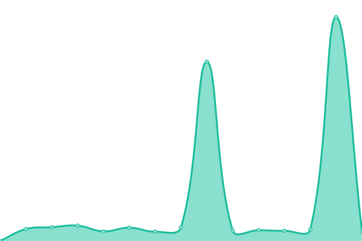

# [📈 Live Status](https://tinyweatherforecastgermanygroup.github.io/statuspage): <!--live status--> **🟩 All systems operational**

This repository contains the open-source uptime monitor and status page for [TinyWeatherForecastGermanyGroup](https://tinyweatherforecastgermanygroup.gitlab.io/index/index.html), powered by [Upptime](https://github.com/upptime/upptime).

With [Upptime](https://upptime.js.org), you can get your own unlimited and free uptime monitor and status page, powered entirely by a GitHub repository. We use [Issues](https://github.com/tinyweatherforecastgermanygroup/statuspage/issues) as incident reports, [Actions](https://github.com/tinyweatherforecastgermanygroup/statuspage/actions) as uptime monitors, and [Pages](https://tinyweatherforecastgermanygroup.github.io/statuspage) for the status page.

<!--start: status pages-->
<!-- This summary is generated by Upptime (https://github.com/upptime/upptime) -->
<!-- Do not edit this manually, your changes will be overwritten -->
<!-- prettier-ignore -->
| URL | Status | History | Response Time | Uptime |
| --- | ------ | ------- | ------------- | ------ |
|  [Codeberg](https://codeberg.org) | 🟩 Up | [codeberg.yml](https://github.com/tinyweatherforecastgermanygroup/statuspage/commits/HEAD/history/codeberg.yml) | 

 674ms
     
 | 

<a href="https://tinyweatherforecastgermanygroup.github.io/statuspage/history/codeberg">95.45%</a>
    

|  [DWD Open Data Server](https://opendata.dwd.de) | 🟩 Up | [dwd-open-data-server.yml](https://github.com/tinyweatherforecastgermanygroup/statuspage/commits/HEAD/history/dwd-open-data-server.yml) | 

 945ms
     
 | 

<a href="https://tinyweatherforecastgermanygroup.github.io/statuspage/history/dwd-open-data-server">100.00%</a>
    

|  [DWD Geoserver](https://maps.dwd.de) | 🟩 Up | [dwd-geoserver.yml](https://github.com/tinyweatherforecastgermanygroup/statuspage/commits/HEAD/history/dwd-geoserver.yml) | 

 2275ms
     
 | 

<a href="https://tinyweatherforecastgermanygroup.github.io/statuspage/history/dwd-geoserver">100.00%</a>
    

|  [F-Droid](https://f-droid.org/) | 🟩 Up | [f-droid.yml](https://github.com/tinyweatherforecastgermanygroup/statuspage/commits/HEAD/history/f-droid.yml) | 

 854ms
     
 | 

<a href="https://tinyweatherforecastgermanygroup.github.io/statuspage/history/f-droid">100.00%</a>
    

|  [index - GitLab Pages](https://tinyweatherforecastgermanygroup.gitlab.io/index/) | 🟩 Up | [index-git-lab-pages.yml](https://github.com/tinyweatherforecastgermanygroup/statuspage/commits/HEAD/history/index-git-lab-pages.yml) | 

 746ms
     
 | 

<a href="https://tinyweatherforecastgermanygroup.github.io/statuspage/history/index-git-lab-pages">100.00%</a>
    

|  [javadoc - GitLab Pages](https://tinyweatherforecastgermanygroup.gitlab.io/twfg-javadoc/) | 🟩 Up | [javadoc-git-lab-pages.yml](https://github.com/tinyweatherforecastgermanygroup/statuspage/commits/HEAD/history/javadoc-git-lab-pages.yml) | 

 383ms
     
 | 

<a href="https://tinyweatherforecastgermanygroup.github.io/statuspage/history/javadoc-git-lab-pages">100.00%</a>
    

|  [summary webpage - frama.io](https://tinyweatherforecastgermanygroup.frama.io/) | 🟩 Up | [summary-webpage-frama-io.yml](https://github.com/tinyweatherforecastgermanygroup/statuspage/commits/HEAD/history/summary-webpage-frama-io.yml) | 

 1018ms
     
 | 

<a href="https://tinyweatherforecastgermanygroup.github.io/statuspage/history/summary-webpage-frama-io">100.00%</a>
    

|  [TinyWeatherForecastGermanyScan - GitHub Pages](https://twfgcicdbot.github.io/TinyWeatherForecastGermanyScan/) | 🟩 Up | [tiny-weather-forecast-germany-scan-git-hub-pages.yml](https://github.com/tinyweatherforecastgermanygroup/statuspage/commits/HEAD/history/tiny-weather-forecast-germany-scan-git-hub-pages.yml) | 

 209ms
     
 | 

<a href="https://tinyweatherforecastgermanygroup.github.io/statuspage/history/tiny-weather-forecast-germany-scan-git-hub-pages">100.00%</a>
    

<!--end: status pages-->

[**Visit our status website →**](https://tinyweatherforecastgermanygroup.github.io/statuspage)

## 📄 License

- Powered by: [Upptime](https://github.com/upptime/upptime)
- Code: [MIT](./LICENSE) © [TinyWeatherForecastGermanyGroup](https://tinyweatherforecastgermanygroup.gitlab.io/index/index.html)
- Data in the `./history` directory: [Open Database License](https://opendatacommons.org/licenses/odbl/1-0/)
